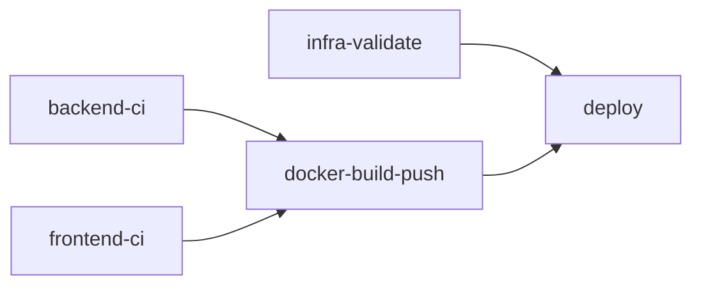

# CI/CD & Infrastructure Standards

## Instructions

### 1. Architecture Decision
Infrastructure as Code uses **Azure Bicep** as per [ADR-0024](file:///Users/martin/repos/shared-list/docs/adr/0024_infrastructure_as_code.md).

Key benefits:
- No remote state file management (Azure is the source of truth).
- Native Azure integration with day-0 resource support.
- Zero additional operational cost.

---

### 2. Pipeline Structure

The CI/CD pipeline (`.github/workflows/ci-cd.yml`) follows this job dependency graph:



#### Jobs Overview

| Job | Purpose | Key Tools |
|-----|---------|-----------|
| `backend-ci` | Build, test, lint Go code | `go vet`, `staticcheck`, `gosec` |
| `frontend-ci` | Build, test, lint TypeScript | `bun lint`, `tsc`, `vitest` |
| `infra-validate` | Validate Bicep syntax | `az bicep build`, `az bicep lint` |
| `docker-build-push` | Build & push to GHCR | `docker/build-push-action` |
| `deploy` | Deploy to Azure Container Apps | `az deployment group create` |

---

### 3. Infrastructure Code

#### Directory Structure
```
infra/
├── main.bicep              # Main orchestration file
├── bicepconfig.json        # Linter configuration
├── modules/
│   ├── container-app.bicep      # Container App resource
│   └── container-app-env.bicep  # Container Apps Environment
└── parameters/
    └── production.bicepparam    # Production parameters
```

#### Best Practices

1. **Modular Design**: Use Bicep modules for reusable components.
2. **Parameters**: Define environment-specific values in `.bicepparam` files.
3. **Secrets**: Use `@secure()` decorator for sensitive parameters. Never commit secrets.
4. **Tags**: Apply consistent tags (`application`, `environment`, `managedBy`) to all resources.
5. **Linting**: Configure rules in `bicepconfig.json` and ensure all code passes `az bicep lint`.

#### Local Validation
```bash
# Validate syntax
az bicep build --file infra/main.bicep --stdout > /dev/null

# Run linter
az bicep lint --file infra/main.bicep
```

---

### 4. Required Secrets

The following GitHub secrets must be configured:

| Secret | Description |
|--------|-------------|
| `AZURE_CREDENTIALS` | Service Principal JSON for Azure login |
| `GHCR_PAT` | GitHub PAT with `read:packages` scope for private images |

---

### 5. Adding a New Environment

1. Create `infra/parameters/<env>.bicepparam`.
2. Add a new job in the workflow or parameterize the existing `deploy` job.
3. Use GitHub Environments for environment-specific protection rules.

---

### 6. Troubleshooting

| Issue | Solution |
|-------|----------|
| Bicep validation fails | Run `az bicep lint --file infra/main.bicep` locally |
| Docker push unauthorized | Verify `GITHUB_TOKEN` has `packages: write` permission |
| Azure deployment fails | Check `az deployment group show --name <deployment-name>` for details |
| GHCR image pull fails | Ensure `GHCR_PAT` has `read:packages` scope |

---

### 7. Quality Gates

All changes must pass:
- ✅ Backend: `go vet`, `staticcheck`, `gosec`, tests with `-race`
- ✅ Frontend: `lint`, `tsc --noEmit`, tests with coverage
- ✅ Infrastructure: `az bicep build`, `az bicep lint`
