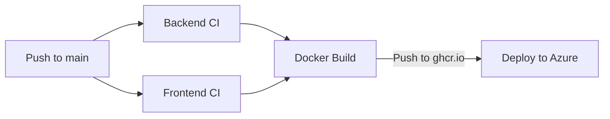

# CI/CD Pipeline Setup Guide

This document describes how to set up the CI/CD pipeline for TogetherList.

## Overview

The pipeline uses **GitHub Actions** to build, test, and deploy to **Azure Container Apps**.  
Container images are stored in **GitHub Container Registry** (ghcr.io).



## Pipeline Jobs

| Job | Description | Duration |
|-----|-------------|----------|
| `backend-ci` | Go build, test, lint, gosec security scan | ~2 min |
| `frontend-ci` | Bun install, TypeScript check, Vitest, audit | ~2 min |
| `docker-build-push` | Multi-stage Docker build, push to ghcr.io | ~3 min |
| `deploy` | Update Azure Container App | ~1 min |

## GitHub Secrets Setup

Navigate to **Repository → Settings → Secrets and variables → Actions** and add:

### Required Secrets for Deployment

| Secret | Purpose | How to Obtain |
|--------|---------|---------------|
| `AZURE_CREDENTIALS` | Azure service principal JSON | See below |
| `GHCR_PAT` | GitHub PAT for GHCR registry access | GitHub → Settings → Developer settings → PATs |

> **Note**: `GITHUB_TOKEN` is automatically provided by GitHub Actions for GHCR push. `GHCR_PAT` is needed for Azure to pull images. Resource group name is embedded in `infra/main.bicep`.

### Creating Azure Credentials

```bash
# Login to Azure CLI
az login

# Create service principal (replace {subscription-id})
az ad sp create-for-rbac \
  --name "togetherlist-cicd" \
  --role contributor \
  --scopes /subscriptions/{subscription-id} \
  --sdk-auth
```

Copy the entire JSON output and paste as the `AZURE_CREDENTIALS` secret value.

## Azure Setup Commands

### Prerequisites

```bash
# Install Azure CLI
brew install azure-cli  # macOS

# Login
az login
```

### Initial Setup (One-time)

Infrastructure is managed as code using Azure Bicep (see [ADR-0024](./adr/0024_infrastructure_as_code.md)).

```bash
# 1. Create resource group (this is the only manual step)
RESOURCE_GROUP="togetherlist-rg"
LOCATION="westeurope"
az group create --name $RESOURCE_GROUP --location $LOCATION

# 2. Create service principal for GitHub Actions
az ad sp create-for-rbac \
  --name "togetherlist-cicd" \
  --role contributor \
  --scopes /subscriptions/$(az account show --query id -o tsv) \
  --sdk-auth

# 3. Create GitHub PAT with read:packages scope for Azure to pull from GHCR
# Go to: GitHub → Settings → Developer settings → Personal access tokens → Tokens (classic)
# Create token with: read:packages scope
```

### Deploy Infrastructure Manually (Optional)

The CI/CD pipeline handles deployments automatically. To deploy manually:

```bash
# Deploy using Bicep (creates resource group automatically)
az deployment sub create \
  --location westeurope \
  --template-file infra/main.bicep \
  --parameters \
    containerImage=ghcr.io/YOUR_USERNAME/shared-list:latest \
    registryUsername=YOUR_GITHUB_USERNAME \
    registryPassword=YOUR_GITHUB_PAT

# Preview changes without applying (what-if)
az deployment sub what-if \
  --location westeurope \
  --template-file infra/main.bicep \
  --parameters infra/parameters/production.bicepparam
```

> **Note**: For GHCR access from Azure, create a GitHub Personal Access Token (PAT) with `read:packages` scope.

## Infrastructure as Code

The `infra/` directory contains Azure Bicep files that define all infrastructure:

| File | Purpose |
|------|---------|
| `main.bicep` | Main orchestration file |
| `modules/container-app-env.bicep` | Container Apps environment |
| `modules/container-app.bicep` | Container App with ingress and scaling |
| `parameters/production.bicepparam` | Production environment parameters |

### Making Infrastructure Changes

1. Modify the relevant `.bicep` file
2. Push to the `cicd` branch
3. The `infra-validate` job validates syntax and linting
4. The `deploy` job applies changes to Azure

## GitHub Container Registry

Images are automatically pushed to:
```
ghcr.io/YOUR_USERNAME/shared-list:SHA
ghcr.io/YOUR_USERNAME/shared-list:latest
```

### Making Packages Public (Optional)

1. Go to your GitHub profile → Packages
2. Click on the `shared-list` package
3. Package settings → Change visibility → Public

## Local Docker Testing

Test the Docker build locally before pushing:

```bash
# Build
docker build -t togetherlist:local .

# Run
docker run --rm -p 8080:8080 -v $(pwd)/data:/data togetherlist:local

# Test
curl http://localhost:8080/health
```

## Monitoring

- **GitHub Actions**: Repository → Actions tab
- **Container Images**: Repository → Packages
- **Azure Portal**: Container Apps → your-app → Metrics/Logs
- **Coverage Reports**: Download artifacts from Actions run

## Troubleshooting

| Issue | Solution |
|-------|----------|
| GHCR push fails | Ensure repo has `packages: write` permission |
| Container won't start | Check logs: `az containerapp logs show --name togetherlist --resource-group myResourceGroup` |
| Azure can't pull from GHCR | Use a GitHub PAT with `read:packages` scope |
| Tests fail in CI | Run locally: `go test ./...` or `bun run test:run` |
